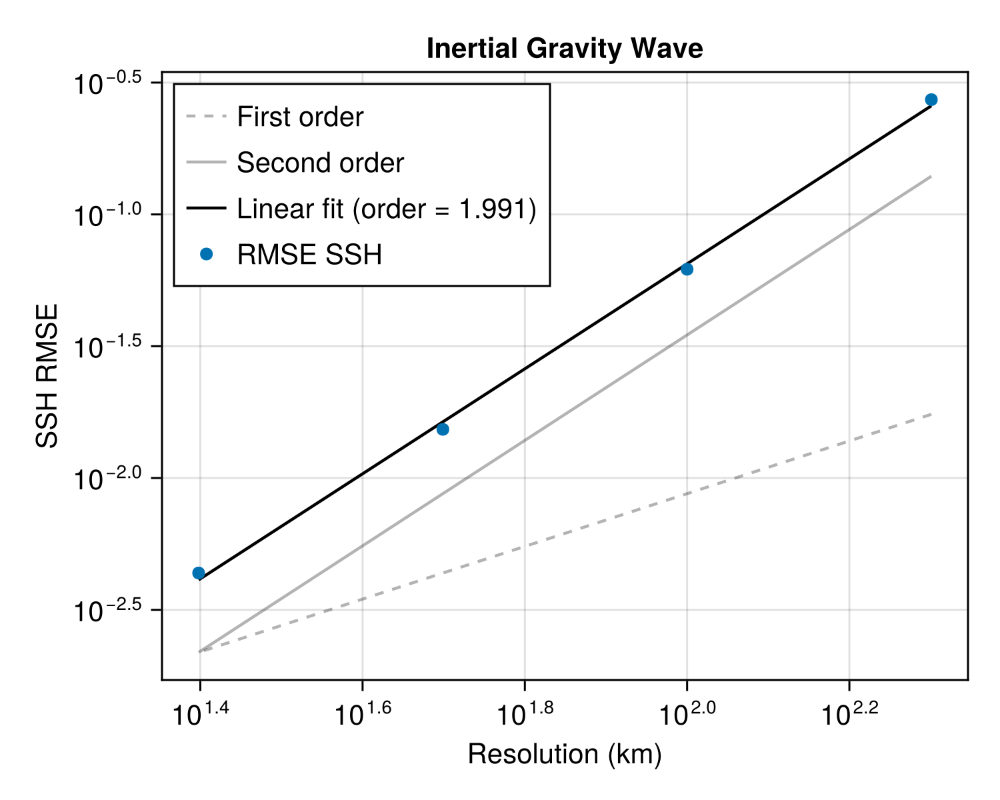

# TRiSK discretization

UnstructuredOceans discretizes the [governing equations](@ref "Governing equations") with the
**TRiSK** scheme (Thuburn–Ringler–Skamarock–Klemp) on unstructured **Voronoi**
meshes with a triangular Delaunay dual — the same family of meshes MPAS uses.

## Mesh entities

A TRiSK mesh carries quantities at three locations, represented in UnstructuredOceans by the
[`Cell`](@ref), [`Edge`](@ref), and [`Vertex`](@ref) marker types and read from an
MPAS NetCDF file by [`read_horz_mesh`](@ref):

- **Cells** ``i`` (primal cell centers, area ``A_i``) — scalars such as layer
  thickness and sea-surface height.
- **Edges** ``e`` (edge midpoints) — the prognostic edge-normal velocity ``v_e``.
- **Vertices** ``v`` (dual triangle centers, area ``A_v``) — vorticity.

Each edge carries two lengths: ``l_e`` (the Voronoi edge separating two adjacent
cells) and ``d_e`` (the distance between those cell centers). Orientation is
carried by the signs ``n_{e,i}, t_{e,v} \in \{\pm 1\}``. The horizontal mesh is
stored as a struct of arrays ([`HorzMesh`](@ref)) and paired with a
[`VerticalMesh`](@ref) in a [`Mesh`](@ref).

## The three primitive operators

The scheme is built from a divergence at cells, a gradient at edges, and a curl
at vertices — implemented as the exported KernelAbstractions kernels
[`DivergenceOnCell!`](@ref), [`GradientOnEdge!`](@ref), and
[`CurlOnVertex!`](@ref):

```math
[\nabla\cdot\mathbf{v}]_i = \frac{1}{A_i}\sum_{e\in\mathrm{EC}(i)} n_{e,i}\, v_e\, l_e ,
```

```math
[\nabla\phi]_e = \frac{\phi_{i_2(e)} - \phi_{i_1(e)}}{d_e} ,
```

```math
[\nabla\times\mathbf{v}]_v = \frac{1}{A_v}\sum_{e\in\mathrm{EV}(v)} t_{e,v}\, v_e\, d_e ,
```

where ``\mathrm{EC}(i)`` are the edges of cell ``i``, ``\mathrm{EV}(v)`` the edges
meeting at vertex ``v``, and ``i_1(e), i_2(e)`` the cells adjacent to edge ``e``.
The divergence and curl are gathers over irregular neighbor lists whose length
varies with the local mesh valence — the structural reason their per-element cost
is sensitive to problem size.

Horizontal momentum mixing is assembled at edges from the divergence
``D = \nabla\cdot\mathbf{v}`` and the relative vorticity ``\zeta``:

```math
[\nabla^2\mathbf{v}]_e = \nu_2\left(\frac{D_{i_2(e)} - D_{i_1(e)}}{d_e}
  - \frac{\zeta_{v_2(e)} - \zeta_{v_1(e)}}{l_e}\right),
```

the discrete form of ``\nabla^2\mathbf{v} = \nabla(\nabla\cdot\mathbf{v}) -
\nabla\times(\nabla\times\mathbf{v})`` restricted to the edge-normal direction.

## Verification

That these discrete operators are mutually consistent is demonstrated by the
inertial gravity wave convergence study: the sea-surface-height RMSE falls by
roughly a factor of four per halving of the grid spacing, and a least-squares fit
gives an observed order of accuracy ``p = 1.991`` — recovering the design
second-order accuracy of TRiSK.



An inconsistency in the operator assembly or the mesh connectivity would
generically degrade this observed order, so the clean second-order slope is
strong evidence the discretization is correct.

For how these operators are turned into portable, differentiable kernels, see
[Software architecture](@ref).
