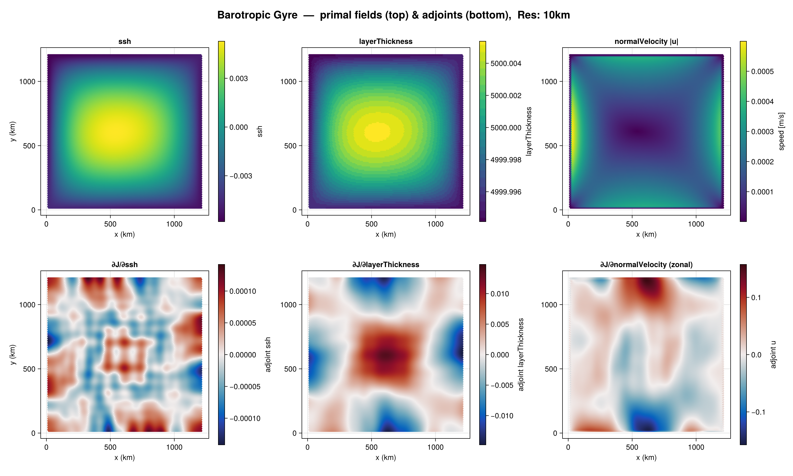

# Automatic differentiation

MOKA is differentiable end-to-end with [Enzyme.jl](https://enzyme.mit.edu/julia/).
Two modes are supported:

- **Forward mode** — cheap for a few inputs; used here to differentiate the final
  state with respect to a scalar parameter (the Laplacian viscosity).
- **Reverse mode (adjoint)** — efficient for many inputs and a scalar objective;
  used to compute the sensitivity of a loss to the whole initial state.
  Time-dependent reverse mode is made tractable with
  [Checkpointing.jl](https://github.com/Argonne-National-Laboratory/Checkpointing.jl)
  (the Revolve scheme).

Both are validated against finite differences in `examples/`.

## Prerequisites

Load the AD packages alongside `MOKA` so the extensions activate:

```julia
using MOKA
using Enzyme
using Checkpointing         # for reverse mode
```

On a GPU, raise the in-kernel malloc heap once before differentiating (see
[Choose a compute backend](@ref)):

```julia
set_ad_device_heap!(arch)
```

## Forward mode: sensitivity to viscosity

[`ocn_run_loop_fwd!`](@ref) advances the model a fixed number of steps while
threading the viscosity `viscDel2` (a length-1 device array) through every
[`ocn_timestep`](@ref). Differentiate it with `Enzyme.autodiff(Forward, …)`,
marking `viscDel2` as `Duplicated` with a tangent of `1`; the shadow of `Prog` on
return holds ∂(final state)/∂(viscosity). Forward mode needs no loss, tape, or
checkpointing.

A complete, runnable example is
`examples/barotropic_gyre/enzyme_forward_test.jl`. It uses a one-day spin-up so
the viscosity signal rises above finite-difference noise, and validates against a
fixed-step FD reference.

## Reverse mode: adjoint of a scalar loss

The objective differentiated in the paper is the sum of squared sea-surface
height at the final time,

```math
J(\mathbf{u}_0) = \sum_{i=1}^{N} \eta_i(T)^2 ,
```

a natural precursor to state-estimation problems. Reverse mode is driven through
the checkpointed loop so each per-step Enzyme tape is freed before the next,
bounding heap use:

- [`OceanModel`](@ref) bundles all evolving state into one checkpointable struct.
- [`ocn_step!`](@ref) advances it by a single step (the unit that is
  differentiated).
- [`ocn_run_loop_checkpointed!`](@ref) runs `nsteps` under a Revolve `scheme`.
- [`ocn_loss`](@ref) runs the loop and returns ``J``.

Allocate a zeroed shadow of the state with [`ocn_init_shadows`](@ref), seed the
adjoint of the scalar objective, and let Enzyme propagate it back to the initial
state. The runnable references are
`examples/barotropic_gyre/enzyme_test.jl` and
`examples/inertial_gravity_wave/enzyme_test.jl`.

The resulting adjoint fields are spatially coherent and free of boundary
artefacts:



## Validation and profiling

- **Gradient checks.** The example tests compare AD gradients against a
  fifth-order central finite-difference estimate; agreement ranges from
  ``\sim 10^{-10}`` (inertial gravity wave) to ``\sim 10^{-5}`` (gyre velocity),
  the latter limited by finite-difference cancellation on small gradients.
- **Profiling.** `examples/barotropic_gyre/PROFILING_AD.md` is a detailed guide
  to profiling the GPU reverse sweep correctly (warm up first, raise the heap,
  keep the horizon short, synchronize before timing).
