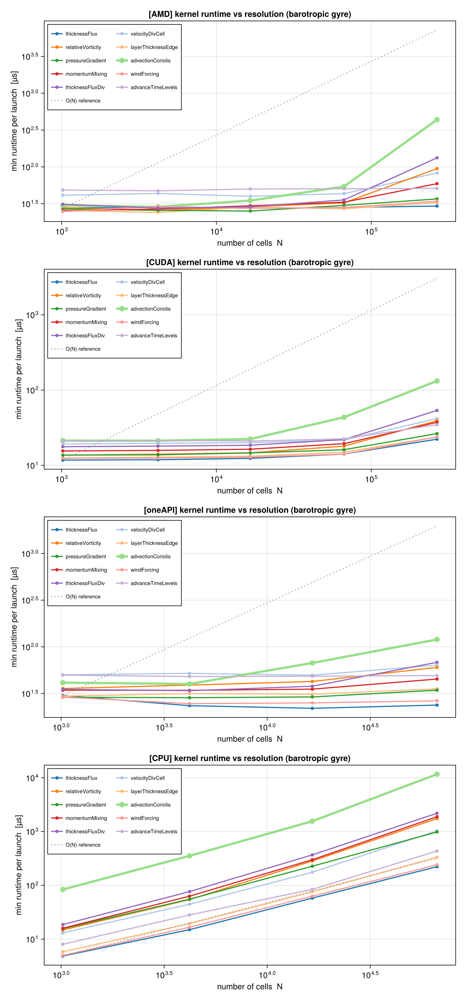
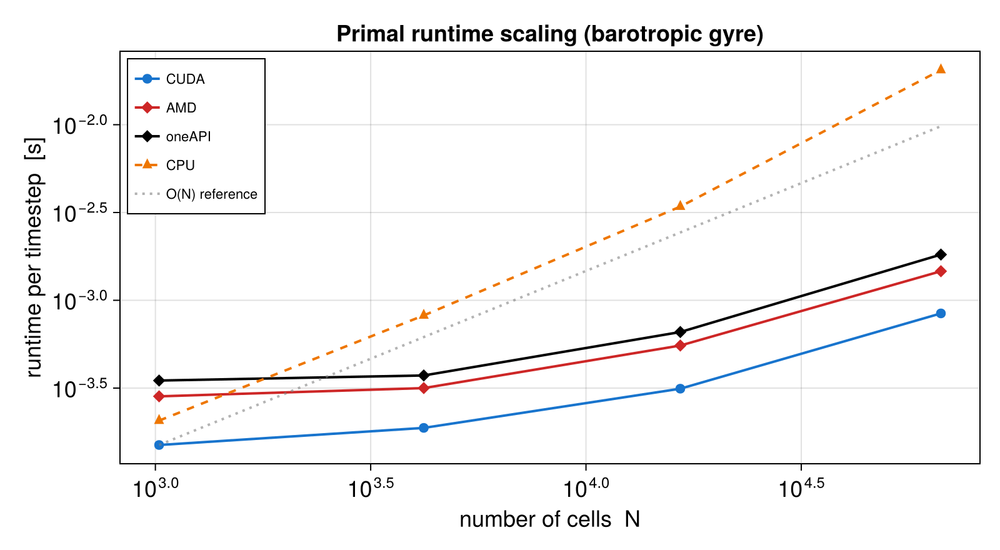

# Run the benchmarks

UnstructuredOceans ships a benchmark suite under `examples/` that measures forward-model and
AD runtime as a function of mesh resolution and hardware backend. All scripts use
[BenchmarkTools.jl](https://github.com/JuliaCI/BenchmarkTools.jl) (warm-up outside
the timed region, minimum-over-samples estimator) and append to CSVs stamped with
the host, device, UTC timestamp, git commit, Julia version, and thread count — so
results from many HPC nodes accumulate into one attributable table. By default
only functional GPUs are swept; the CPU is opt-in.

## Per-kernel benchmark (barotropic gyre)

Times each individual forward-step kernel (thickness flux, divergence, relative
vorticity, edge interpolation, pressure gradient, advection/Coriolis, momentum
mixing, wind forcing, time-level advance) across the resolution ladder, with a
device `synchronize` inside the timed region so device execution — not launch
latency — is measured:

```bash
julia --project=. examples/barotropic_gyre/kernel_benchmark.jl
julia examples/barotropic_gyre/plot_kernel_benchmark.jl   # -> kernel_benchmark.png
```



## Resolution-scaling benchmarks

Two companion scripts share the machinery in
`examples/resolution_scaling_common.jl` and sweep a problem family's ladder (each
refinement quadruples the cell count):

```bash
# forward model (I/O-free ocn_run_loop)
julia --project=. examples/resolution_scaling_benchmark.jl
# checkpointed reverse-mode adjoint
julia --project=. examples/resolution_scaling_ad_benchmark.jl
# figures (need only CairoMakie + DelimitedFiles)
julia examples/plot_resolution_scaling_benchmark.jl
```

Select the problem family with the `RES_BENCH_PROBLEM` environment variable
(`gyre` or `igw`). The plot script writes one figure per problem case, with the
problem name appended before the extension — e.g.
`resolution_scaling_benchmark_gyre.png` for the forward model and
`resolution_scaling_ad_benchmark_gyre.png` for the checkpointed adjoint.



The GPU backends show favorable sub-linear scaling as resolution increases, in
contrast to the linear growth on CPU — the same kernels, unchanged, across
NVIDIA, AMD, and Intel hardware.

## Reproducing the paper

The paper's appendix documents the full reproduction recipe, including mesh
generation and the convergence and adjoint studies. The verification scripts live
alongside the benchmarks: `analysis.jl` / `convergence.jl` for the gyre and
`compare.jl` for the inertial gravity wave, and `plot_adjoint.jl` for the AD
sensitivity figures.
