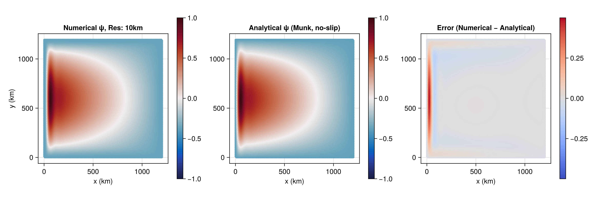

```@meta
CurrentModule = UnstructuredOceans
```

# Getting started

This tutorial walks through running your first UnstructuredOceans simulation: a wind-driven
**barotropic gyre**, one of the two verification cases shipped with the package.
By the end you will have integrated the shallow-water equations forward in time
and written the result to a NetCDF file.

We will use the ready-made inputs under `examples/barotropic_gyre/`, so no mesh
generation is required — each resolution directory already ships a
`culled_mesh.nc` and `initial_state.nc`.

## 1. Get the repository

The example inputs live in the repository, so clone it and instantiate the
environment:

```bash
git clone https://https://github.com/SciDAC-ImPACTS/Moka.jl UnstructuredOceans.jl
cd UnstructuredOceans.jl
julia --project=. -e 'using Pkg; Pkg.instantiate()'
```

## 2. Run from the command line (the quick path)

Every forward simulation is fully specified by one YAML configuration file and
launched through the driver `src/driver/mpas_ocean.jl`:

```bash
# CPU
julia --project=. src/driver/mpas_ocean.jl examples/barotropic_gyre/10km/config.yml
# NVIDIA GPU (loads CUDA and runs on GPU())
julia --project=. src/driver/mpas_ocean.jl examples/barotropic_gyre/10km/config.yml cuda
```

The driver reads the config, builds the mesh and clock, integrates to the
configured stop time, and writes `examples/barotropic_gyre/10km/output.nc`.

## 3. Run from Julia (the API path)

The driver is a thin wrapper over the public API. Running the same simulation
yourself shows the sequence you would use to embed UnstructuredOceans in your own code:

```julia
using UnstructuredOceans
using Dates
import KernelAbstractions as KA
using GPUArraysCore: @allowscalar

config = "examples/barotropic_gyre/10km/config.yml"

# Choose where the model runs. CPU() needs no extra packages; for a GPU, load
# CUDA / AMDGPU / oneAPI first and use GPU() (see the backend how-to).
backend = KA.CPU()

# 1. Initialize mesh, clock, and prognostic/diagnostic/tendency state.
Setup, Diag, Tend, Prog = ocn_init(config; backend = backend)

# 2. Recover the clock and the simulation-end / output alarms.
clock, simulationAlarm, outputAlarm = ocn_init_alarms(Setup)

# 3. Build the timestep as a length-1 device array of seconds (kept on-device so
#    the update kernels read it without a host copy).
timestep = KA.zeros(backend, Float64, (1,))
@allowscalar timestep[1] = Float64(Dates.value(Second(Setup.timeManager.timeStep)))

# 4. Select the time integrator from the config string.
ti = UnstructuredOceans.config_get(UnstructuredOceans.config_get(Setup.config.namelist, "time_integration"),
                    "config_time_integrator")
integrator = parse_integrator(ti)     # RungeKutta4 or ForwardEuler

# 5. Open the output dataset, run the loop, and finalize.
output_ds = io_initialize(Setup, Prog)
ocn_run_loop(timestep, Prog, Diag, Tend, Setup, integrator,
             clock, simulationAlarm, outputAlarm; output_ds = output_ds)
io_finalize(output_ds)
```

The functions used here are the core of the public API:
[`ocn_init`](@ref) → [`ocn_init_alarms`](@ref) → [`parse_integrator`](@ref) →
[`io_initialize`](@ref) → [`ocn_run_loop`](@ref) → [`io_finalize`](@ref).

## 4. Inspect the result

`Prog` now holds the final state; `Prog.ssh[end]`, `Prog.normalVelocity[end]`,
and `Prog.layerThickness[end]` are the sea-surface height, edge-normal velocity,
and layer thickness (see [`PrognosticVars`](@ref)). The written `output.nc`
contains the mesh coordinates and the fields at each output interval.

The example directory includes analysis scripts that reconstruct the barotropic
streamfunction and compare it to the analytical Munk solution
(`examples/barotropic_gyre/analysis.jl` and `convergence.jl`). After a full
spin-up the model reproduces the intensified western boundary current and the
interior Sverdrup flow:



## Next steps

- Run on a GPU or switch vendors → [Choose a compute backend](@ref)
- Compute gradients of a run → [Automatic differentiation](@ref)
- Understand the YAML options → [Configure a simulation](@ref)
- Learn the numerics → [Governing equations](@ref)
